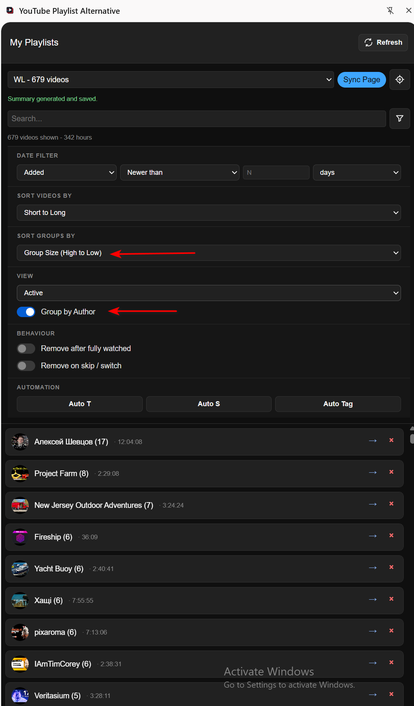

# YouTube Playlist Alternative

If you are tired of the chaos in YouTube Watch Later, this extension helps you turn that pile of saved videos into something you can actually manage.

I built it for myself because I wanted more control over my YouTube video lists. During the first three days of testing, I reduced my Watch Later list from 1,250 videos to 670 - 580 fewer videos. Most of them were either no longer relevant, not worth watching anymore, or could be handled faster by reading a summary instead of spending time on the full video.

The goal is simple: make it easy to review, filter, summarize, move, restore, and clean up old or uninteresting videos. The project combines a Chrome/Chromium extension with a local Node.js API and SQLite storage, so your playlist management stays local and under your control.

## Features

- Stores personal playlists locally without depending on a YouTube account.
- Adds videos from the active YouTube page through the popup or docked panel.
- Syncs real YouTube playlists into local lists from the playlist page.
- Tracks videos removed from the source playlist, unavailable on YouTube, quietly deleted by YouTube, moved, skipped, watched, or manually removed.
- Provides a compact YouTube overlay panel with search, sorting, author grouping, and status filters.
- Supports automatic cleanup for fully watched or skipped videos.
- Helps decide what is still worth watching with transcripts, summaries, and tags.
- Includes a dedicated manager for creating, renaming, deleting, and linking playlists to YouTube source URLs.
- Fetches YouTube metadata: title, author, thumbnail, duration, views, and availability.
- Downloads transcripts through the paid FetchTranscript API. This is not an ad; it just fit this project perfectly. For my usage, it looks like about $5 should be enough for a year.
- Generates text/HTML summaries and tags through the paid OpenRouter API. The actual cost depends on the model you choose and how actively you generate summaries or tags. I currently recommend `google/gemini-2.5-flash`, which is what I use for both text and HTML summaries.
- Exposes settings for models, summary language, prompts, transcript language priority, and preferred tags.

## Screenshots

### YouTube overlay panel


### Summary page


### Filters and author groups



## Architecture

```text
ytb-playlists/
  extension/        Chrome/Chromium extension UI and YouTube integration
  server/           Express API, SQLite schema, transcript and summary services
  database.sqlite   Local runtime database, ignored by git
```

The server runs at `http://localhost:3001`, and the extension talks to it through `http://localhost:3001/api`.

## Server Setup

1. Go to the server directory:

   ```bash
   cd server
   ```

2. Install dependencies:

   ```bash
   npm install
   ```

3. Create a local env file:

   ```bash
   cp .env.example .env
   ```

4. Fill in the keys in `server/.env`:

   ```env
   PORT=3001
   FETCHTRANSCRIPT_API_KEY=yt_your_api_key
   FETCHTRANSCRIPT_LANGUAGE=en
   OPENROUTER_API_KEY=sk-or-v1-your_openrouter_key
   ```

5. Start the development server:

   ```bash
   npm run dev
   ```

For a production-like run, use:

```bash
npm run build
npm start
```

## Extension Setup

1. Open `chrome://extensions`.
2. Enable `Developer mode`.
3. Click `Load unpacked`.
4. Select the `extension` directory.
5. Make sure the local server is running on `localhost:3001`.
6. Open YouTube and use the popup, docked panel, or manager.

## Typical Workflow

1. Start the server.
2. Open a YouTube playlist or video page.
3. Click `Dock Panel` in the popup.
4. Create or select a local playlist.
5. On a YouTube playlist page, click `Sync Page` to import videos from the page.
6. Use search, filters, sorting, move/remove/restore, and summary actions in the panel.

## Configuration

- `PORT` - local API port.
- `FETCHTRANSCRIPT_API_KEY` - FetchTranscript API key for transcript retrieval.
- `FETCHTRANSCRIPT_LANGUAGE` - fallback transcript language.
- `FETCHTRANSCRIPT_LANGUAGES` - optional comma-separated language priority list, for example `en,uk,ru`.
- `FETCHTRANSCRIPT_BASE_URL` - optional custom FetchTranscript API endpoint.
- `OPENROUTER_API_KEY` - OpenRouter key for summaries and tags.
- `OPENROUTER_BASE_URL` - optional custom OpenRouter-compatible endpoint.

> Warning: Keep a small spending limit on the OpenRouter API key you use with this project. If the app is misconfigured or used too aggressively, generating summaries or tags for a large library can consume credits quickly. For example, running summary generation across 1,000 videos may become expensive depending on the selected model and transcript length.

Recommended starter settings and prompts are documented in `BASE_SETTINGS.md`.

## Security And Git

Local data and secrets must not be committed. `.gitignore` covers:

- `server/.env` and any `.env.*` files except examples;
- SQLite databases: `database.sqlite`, `*.sqlite`, `*.db`;
- runtime logs;
- `node_modules`, build output, and TypeScript cache;
- `exports/`, `uploads/`;
- private keys, certificates, and packaged extension artifacts.

Before committing, it is useful to run:

```bash
git status --ignored --short
git ls-files --cached --ignored --exclude-standard
```

The second command should return an empty result.

## Contributing

Ideas, bug reports, and pull requests are welcome!

If you have a feature idea or found something that could be improved - open an issue or submit a PR. The project is intentionally simple and focused, so contributions that keep it lean and useful are most appreciated.

## License

This project is distributed under the ISC License. See `LICENSE` for details.
