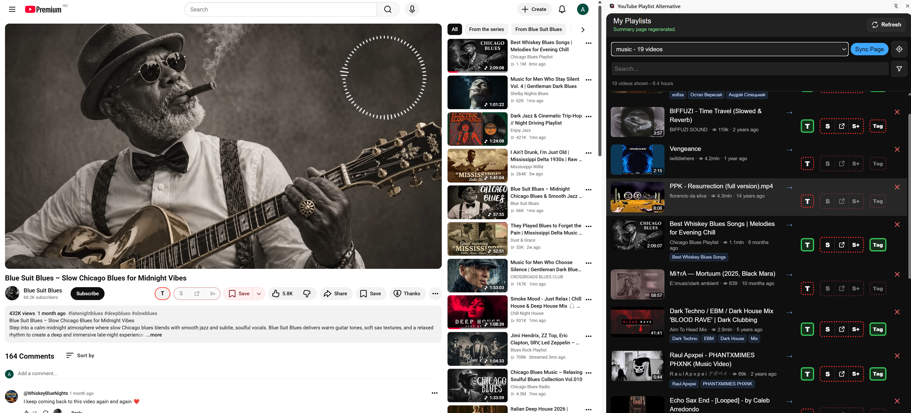
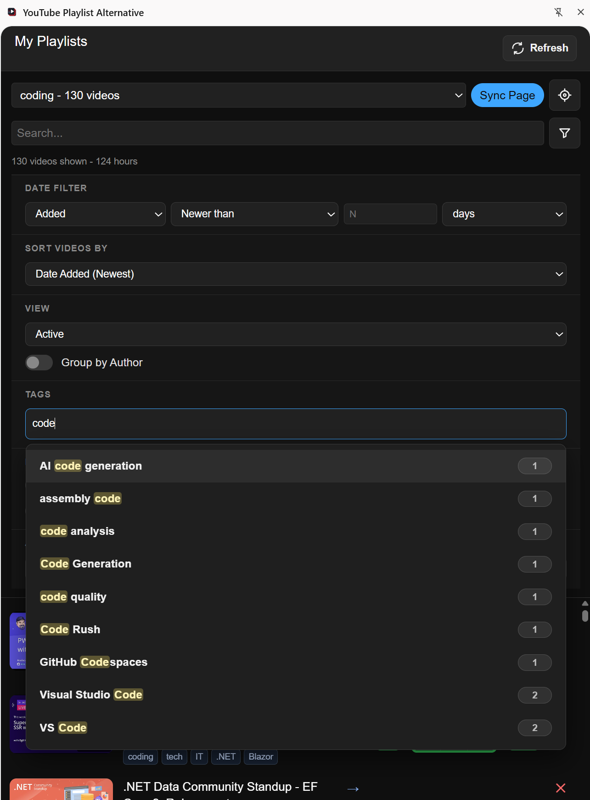

# YouTube Playlist Alternative

If you are tired of the chaos in YouTube Watch Later, this extension helps you turn that pile of saved videos into something you can actually manage.

I built it for myself because I wanted more control over my YouTube video lists. During the first three days of testing, I reduced my Watch Later list from 1,250 videos to 670 - 580 fewer videos. Most of them were either no longer relevant, not worth watching anymore, or could be handled faster by reading a summary instead of spending time on the full video.

The goal is simple: make it easy to review, filter, summarize, move, restore, and clean up old or uninteresting videos. The project combines a Chrome/Chromium extension with a Node.js API and SQLite storage. The API can run locally or on a private remote server.

## Features

- Stores personal playlists locally without depending on a YouTube account.
- Adds videos from the active YouTube page through the popup or docked panel.
- Syncs real YouTube playlists into local lists from the playlist page.
- Tracks videos removed from the source playlist, unavailable on YouTube, quietly deleted by YouTube, moved, skipped, watched, or manually removed.
- Provides a compact YouTube overlay panel with search, sorting, author grouping, and status filters.
- Supports automatic cleanup for fully watched or skipped videos.
- Helps decide what is still worth watching with transcripts, summaries, and tags.
- Includes a dedicated manager for creating, renaming, deleting, and linking playlists to YouTube source URLs.
- Fetches YouTube metadata: title, author, thumbnail, duration, views, and availability.
- Downloads transcripts through the paid FetchTranscript API. This is not an ad; it just fit this project perfectly. For my usage, it looks like about $5 should be enough for a year.
- Generates text/HTML summaries and tags through the paid OpenRouter API. The actual cost depends on the model you choose and how actively you generate summaries or tags. I currently recommend `google/gemini-2.5-flash`, which is what I use for both text and HTML summaries.
- Exposes settings for models, summary language, prompts, transcript language priority, and preferred tags.

## How It Works

The program starts by syncing a YouTube playlist into a local playlist stored in SQLite. After that first import, daily video management happens inside this app: you can review, filter, summarize, tag, move, skip, restore, or remove videos without depending on YouTube's playlist UI.

Each playlist in the app can work in one of two modes:

- Independent local list - it is managed only inside the app and does not need a YouTube playlist link.
- Linked YouTube list - it is connected to a YouTube playlist URL and can be synchronized with that playlist.

The intended workflow is to process videos locally first, then sync the result back to YouTube when needed. That makes it possible to reconcile videos that were processed, removed, moved, or reorganized in the app with the original YouTube playlist instead of manually repeating the same cleanup on YouTube.

## Screenshots

### Linked YouTube playlist



### Summary page popup


### Filters and tags



## Architecture

```text
ytb-playlists/
  extension/                  Chrome/Chromium extension UI and YouTube integration
    api.js                    HTTP client for the local API with caching and background proxy
    content-dom.js            Read-only DOM adapters for YouTube pages (playlist, watch, comments)
    content.js                Content-script behaviour: sync, quick save, watch controls, ask panel
    panel-template.js         HTML template of the docked/floating panel
    panel-utils.js            Pure helpers: formatting, video status, tags
    panel-ui.js               Panel state, rendering, and interactions
    background.js             Service worker: messaging, tabs, sync orchestration
  server/                     Express API, SQLite schema, transcript and summary services
    src/
      index.ts                App entry point
      db.ts                   SQLite connection, schema, migrations
      prompts.ts              Default LLM prompts
      validation.ts           Zod schemas and request normalization
      routes/                 Domain routers: playlists, videos, sync, summaries, transcripts
      services/               Background queues: metadata refresh, availability, auto assets
      lib/                    Shared query and metadata helpers
  database.sqlite             Local runtime database, ignored by git
```

The server listens on port `3001` by default. Every `/api` route requires the shared `X-API-Token` header and is protected by per-IP adaptive rate limiting.

## Server Setup

1. Go to the server directory:

   ```bash
   cd server
   ```

2. Install dependencies:

   ```bash
   npm install
   ```

3. Create a local env file:

   ```bash
   cp .env.example .env
   ```

4. Fill in the keys in `server/.env`:

   ```env
   PORT=3001
   API_TOKEN=replace_with_a_long_random_token
   TRUST_PROXY=false
   RATE_LIMIT_WINDOW_MS=60000
   RATE_LIMIT_MAX_REQUESTS=120
   RATE_LIMIT_BLOCK_MS=30000
   RATE_LIMIT_MAX_BLOCK_MS=900000
   RATE_LIMIT_STRIKE_RESET_MS=900000
   FETCHTRANSCRIPT_API_KEY=yt_your_api_key
   FETCHTRANSCRIPT_LANGUAGES=en,uk,ru
   OPENROUTER_API_KEY=sk-or-v1-your_openrouter_key
   ```

5. Start the development server:

   ```bash
   npm run dev
   ```

For a production-like run, use:

```bash
npm run build
npm start
```

To run the API with Docker:

```bash
cd server
docker compose up -d --build
```

The Compose configuration stores SQLite data in a named volume and publishes the API only on `127.0.0.1:4319`, ready for a local reverse proxy.

## Extension Setup

1. Copy `extension/config.example.js` to `extension/config.local.js`.
2. Set `apiBaseUrl` and use the same `apiToken` value as `API_TOKEN` in `server/.env`.
3. Open `chrome://extensions`.
4. Enable `Developer mode`.
5. Click `Load unpacked`.
6. Select the `extension` directory.
7. Open YouTube and use the popup, docked panel, or manager.

For a remote server, set `apiBaseUrl` to an HTTPS URL ending in `/api`, for example `https://playlists.example.com/api`. Reload the extension after changing `config.local.js`.

## Typical Workflow

1. Start the server.
2. Open a YouTube playlist or video page.
3. Click `Dock Panel` in the popup.
4. Create or select a local playlist.
5. On a YouTube playlist page, click `Sync Page` to import videos from the page.
6. Use search, filters, sorting, move/remove/restore, and summary actions in the panel.

## Configuration

- `PORT` - local API port.
- `DATABASE_PATH` - SQLite database path. Docker uses `/data/database.sqlite` in a persistent volume.
- `API_TOKEN` - shared secret required in the `X-API-Token` header for every API request.
- `TRUST_PROXY` - Express proxy trust setting. Use the exact proxy hop count, such as `1`, when the server is behind one trusted reverse proxy; keep `false` when it is directly exposed.
- `RATE_LIMIT_WINDOW_MS` - request-counting window per IP.
- `RATE_LIMIT_MAX_REQUESTS` - allowed requests per IP within one window.
- `RATE_LIMIT_BLOCK_MS` - initial temporary block duration after the limit is exceeded.
- `RATE_LIMIT_MAX_BLOCK_MS` - maximum block duration.
- `RATE_LIMIT_STRIKE_RESET_MS` - quiet period after which escalating block history is cleared.
- `FETCHTRANSCRIPT_API_KEY` - FetchTranscript API key for transcript retrieval.
- `FETCHTRANSCRIPT_LANGUAGES` - optional comma-separated language priority list, for example `en,uk,ru`.
- `FETCHTRANSCRIPT_BASE_URL` - optional custom FetchTranscript API endpoint.
- `OPENROUTER_API_KEY` - OpenRouter key for summaries and tags.
- `OPENROUTER_BASE_URL` - optional custom OpenRouter-compatible endpoint.

> Warning: Keep a small spending limit on the OpenRouter API key you use with this project. If the app is misconfigured or used too aggressively, generating summaries or tags for a large library can consume credits quickly. For example, running summary generation across 1,000 videos may become expensive depending on the selected model and transcript length.

Recommended starter settings and prompts are documented in `BASE_SETTINGS.md`.

## Security And Git

Local data and secrets must not be committed. `.gitignore` covers:

- `server/.env` and any `.env.*` files except examples;
- `extension/config.local.js`, which contains the shared API token and server URL;
- SQLite databases: `database.sqlite`, `*.sqlite`, `*.db`;
- runtime logs;
- `node_modules`, build output, and TypeScript cache;
- `exports/`, `uploads/`;
- private keys, certificates, and packaged extension artifacts.

Before committing, it is useful to run:

```bash
git status --ignored --short
git ls-files --cached --ignored --exclude-standard
```

The second command should return an empty result.

## Contributing

Ideas, bug reports, and pull requests are welcome!

If you have a feature idea or found something that could be improved - open an issue or submit a PR. The project is intentionally simple and focused, so contributions that keep it lean and useful are most appreciated.

## License

This project is distributed under the ISC License. See `LICENSE` for details.
